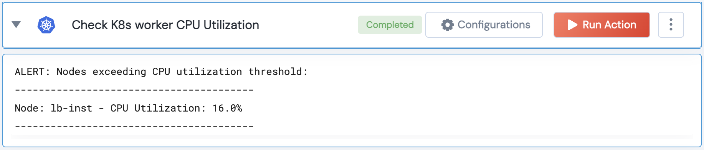

[]
(https://unskript.com/assets/favicon.png)
<h1>Check K8s worker CPU Utilization</h1>

## Description
Retrieves the CPU utilization for all worker nodes in the cluster and compares it to a given threshold.

## Lego Details
	k8s_check_worker_cpu_utilization(handle, threshold: float=70)
		handle: Object of type unSkript K8S Connector.
		threshold: Threshold for CPU utilization in percentage.

## Lego Input
This Lego takes inputs handle, threshold.

## Lego Output
Here is a sample output.

## See it in Action

You can see this Lego in action following this link [unSkript Live](https://us.app.unskript.io)