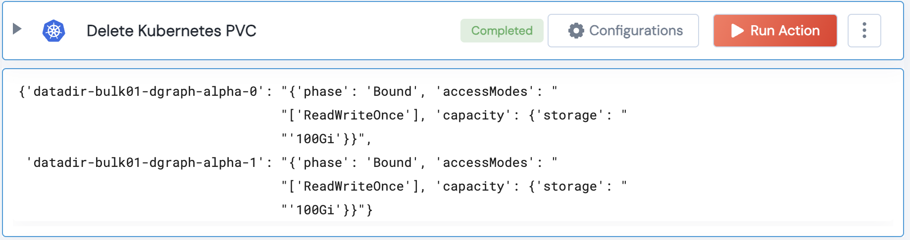

[]
(https://unskript.com/assets/favicon.png)
<h1>Delete Kubernetes PVC</h1>

## Description
This action force deletes a list of Kubernetes PVCs in a given Namespace.

## Lego Details
	k8s_delete_pvc(handle, namespace: str, pvc_names: list)
		handle: Object of type unSkript K8S Connector.
		namespace: Kubernetes namespace
		pvc_names: List of K8S PVC Names. Eg: ["data-dir-1", "data-dir-2"]

## Lego Input
This Lego takes inputs handle, namespace, pvc_names

## Lego Output
Here is a sample output.

## See it in Action

You can see this Lego in action following this link [unSkript Live](https://us.app.unskript.io)