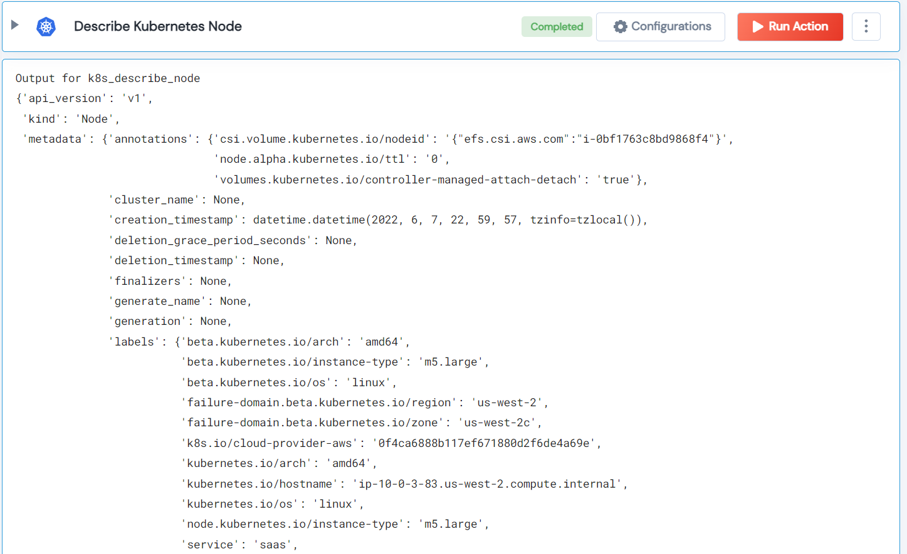

 
<h2>Describe Kubernetes Node</h2>

 

## Description
This Lego describe Kubernetes Node.

## Lego Details

    k8s_describe_node(handle: object, node_name: str)

        handle: Object of type unSkript K8S Connector
        node_name: Kubernetes namespace

## Lego Input
This Lego take two input handle and node_name.

## Lego Output
Here is a sample output.

## See it in Action

You can see this Lego in action following this link [unSkript Live](https://us.app.unskript.io)