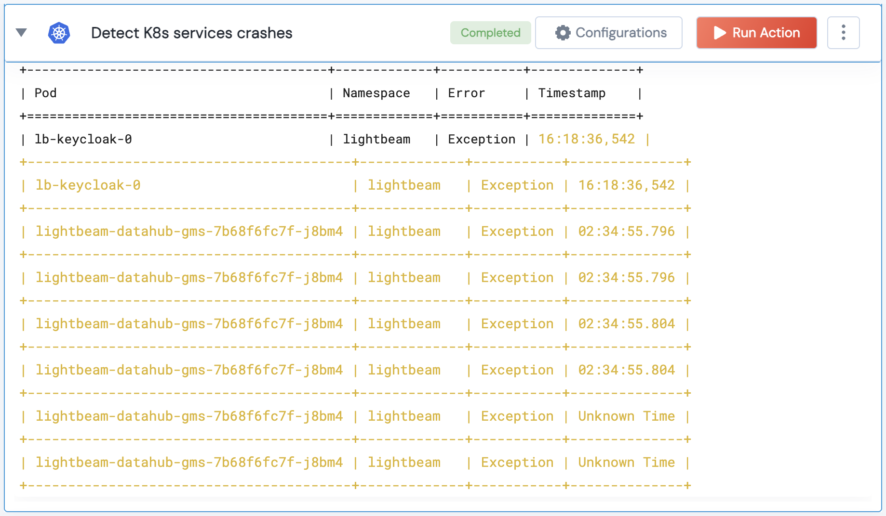

 
<h2>Detect K8s services crashes</h2>

 

## Description
This action detects service crashes by checking the logs of each pod for specific error messages.

## Lego Details

    k8s_detect_service_crashes(handle, namespace: str = '', tail_lines: int = 100)

        handle: Object of type unSkript K8S Connector
        namespace: Kubernetes namespace (Optional)
        tail_lines: Number of log lines to fetch from each container. Defaults to 100.

## Lego Input
This Lego take four input handle, namespace, tail_lines.

## Lego Output
Here is a sample output.

## See it in Action

You can see this Lego in action following this link [unSkript Live](https://us.app.unskript.io)