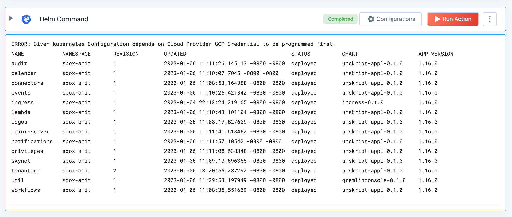

 
<h2>Execute helm command</h2>

 

## Description
This Lego Executes helm command in a given k8s cluster.

## Lego Details

    k8s_execute_helm_command(handle: object, helm_command: str)
        handle: Object of type unSkript K8S Connector
        helm_command: helm command to execute on the k8s cluster

## Lego Input
This Lego take two inputs: handle and helm_command

## Lego Output
Here is a sample output.

## See it in Action

You can see this Lego in action following this link [unSkript Live](https://us.app.unskript.io)