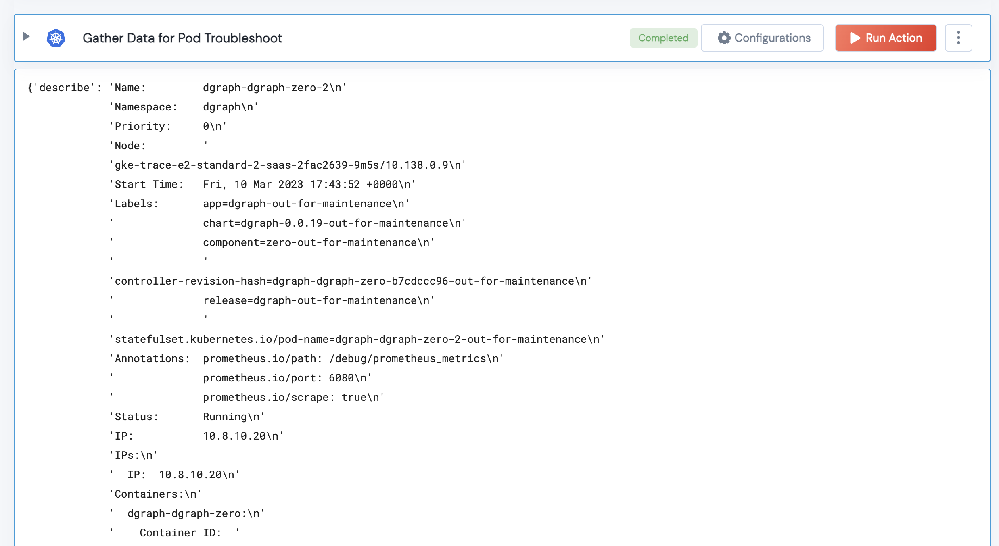

 
<h2>Gather Data to Troubleshoot POD</h2>

 

## Description
This Action can be used to gather all relevant data to troubleshoot a POD in error state.
This Action gathers 
* POD Status
* POD Logs
* POD Events 

## Lego Details

    k8s_gather_data_for_pod_troubleshoot(handle: object, pod_name: str, namespace: str)

        handle: Object of type unSkript K8S Connector
        pod_name: String, Name of the POD (Mandatory parameter)
        namespace: String, Namespace where the POD exists

## Lego Input
This Lego takes three mandatory inputs. Handle (K8S) object returned from the task.validator(...),
POD Name and Namespace where the POD exists. 

## Lego Output
This Action outputs a Dict with `describe` and `logs` as keys. Here is a sample output.

## See it in Action

You can see this Lego in action following this link [unSkript Live](https://us.app.unskript.io)