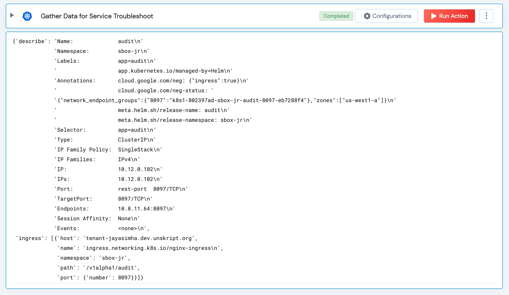

 
<h1>Gather data for K8S Service troubleshooting </h1>

## Description
This Action can be used to gather data to aid in troubleshooting k8s service in a namespace. 

## Lego Details

    k8s_gather_data_for_service_troubleshoot(handle, namespace: str)

        handle: Object of type unSkript K8S Connector
        namespace: k8s namespace.

## Lego Input

This Lego take two inputs handle, and namespace.

## Lego Output
Here is a sample output.

## See it in Action

You can see this Lego in action following this link [unSkript Live](https://us.app.unskript.io)