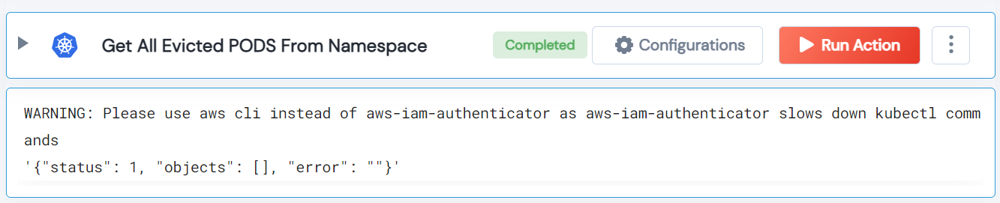

 
<h1>Get All Evicted PODS From Namespace </h1>

## Description
This Lego get all evicted PODS from given namespace. If namespace not given it will get all the pods from all namespaces.

## Lego Details

    k8s_get_all_evicted_pods_from_namespace(handle, namespace: str = "")

        handle: Object of type unSkript K8S Connector
        namespace: k8s namespace.

## Lego Input

This Lego take two inputs handle, and namespace.

## Lego Output
Here is a sample output.

## See it in Action

You can see this Lego in action following this link [unSkript Live](https://us.app.unskript.io)