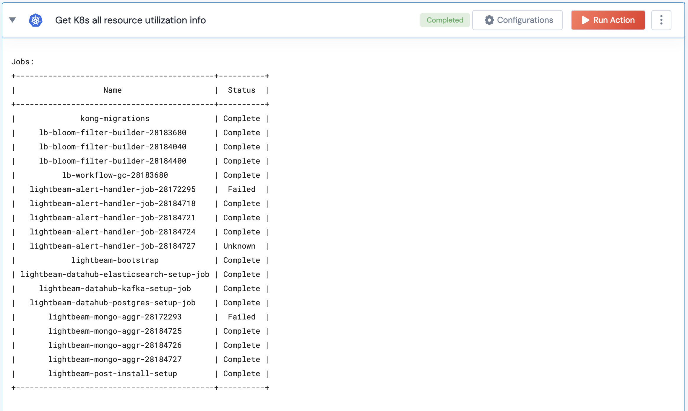

[]
(https://unskript.com/assets/favicon.png)
<h1>Get K8s all resource utilization info</h1>

## Description
This action gets the pod status and resource utilization of various Kubernetes resources like jobs, services, persistent volumes.

## Lego Details
	k8s_get_all_resources_utilization_info(handle, namespace:str="")
		handle: Object of type unSkript K8S Connector.
		namespace: Namespace in which to look for the resources. If not provided, all namespaces are considered

## Lego Input
This Lego takes inputs handle, namespace(optional)

## Lego Output
Here is a sample output.

## See it in Action

You can see this Lego in action following this link [unSkript Live](https://us.app.unskript.io)