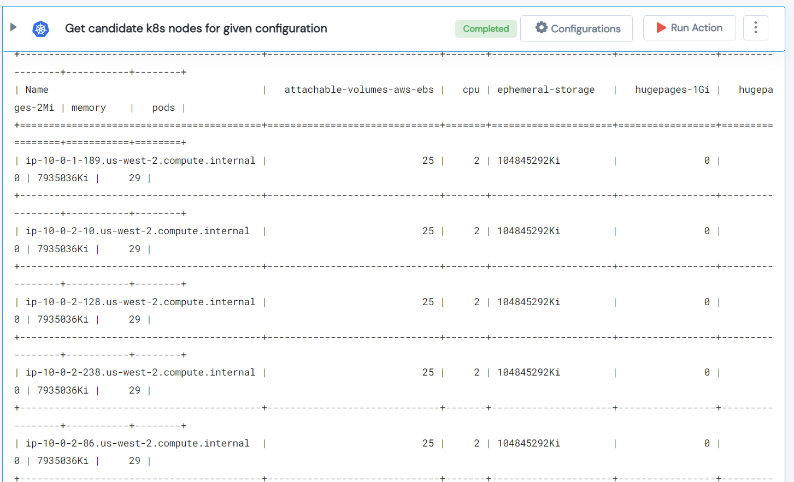

 
<h2>Get candidate k8s nodes</h2>

 

## Description
This Lego get candidate k8s nodes for given configuration.

## Lego Details

    k8s_get_candidate_nodes_for_pods(handle: object, attachable_volumes_aws_ebs: int = 0, 
                                     cpu_limit: int, 
                                     memory_limit: str, 
                                     pod_limit: int)

        handle: Object of type unSkript K8S Connector
        attachable_volumes_aws_ebs: EBS Volume limit in Gb.
        cpu_limit: CPU Limit.
        memory_limit: Limits and requests for memory are measured in bytes.
        pod_limit: Pod Limit.

## Lego Input
This Lego take five input handle, attachable_volumes_aws_ebs, cpu_limit, memory_limit and pod_limit.

## Lego Output
Here is a sample output.

## See it in Action

You can see this Lego in action following this link [unSkript Live](https://us.app.unskript.io)