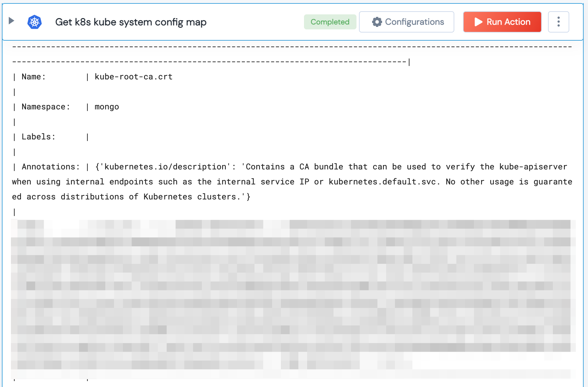

 
<h2>Get k8s kube system config map</h2>

 

## Description
This Lego get k8s kube system config map.

## Lego Details

    k8s_get_config_map_kube_system(handle: object,config_map_name: str, namespace: str)

        handle: Object of type unSkript K8S Connector
        config_map_name: Kubernetes Config Map Name.(Optional)
        namespace: Kubernetes namespace.(Optional)

## Lego Input
This Lego take three input handle, config_map_name and namespace.

## Lego Output
Here is a sample output.

## See it in Action

You can see this Lego in action following this link [unSkript Live](https://us.app.unskript.io)