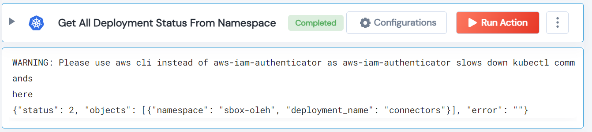

 
<h1>Get All Deployment Rollout Status From Namespace </h1>

## Description
This Lego get deployment rollout status for the given inputs. If namespace and deployment name not given it will get all the failed deployment rollout status from all namespaces.

## Lego Details

    k8s_get_deployment_status(handle, deployment: str = "", namespace: str = "")

        handle: Object of type unSkript K8S Connector
        namespace: Optional - k8s namespace.
        deployment: Optional - k8s deployment name.

## Lego Input

This Lego take two inputs handle, deployment and namespace.

## Lego Output
Here is a sample output.

## See it in Action

You can see this Lego in action following this link [unSkript Live](https://us.app.unskript.io)