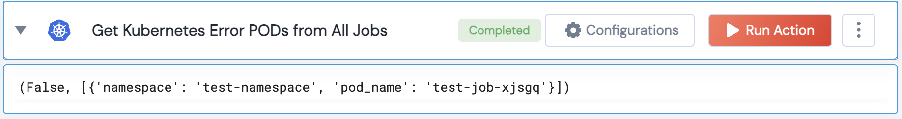

 
<h1>Get Kubernetes Error PODs from All Jobs</h1>

## Description
This Lego gets all failed or error pods from all jobs for a given namespace.

## Lego Details

    k8s_get_error_pods_from_all_jobs(handle, namespace: str = '') 

        handle: Object of type unSkript K8S Connector
        namespace: k8s namespace (Optional)

## Lego Input

This Lego take two inputs handle, and namespace (Optional).

## Lego Output
Here is a sample output.

## See it in Action

You can see this Lego in action following this link [unSkript Live](https://us.app.unskript.io)