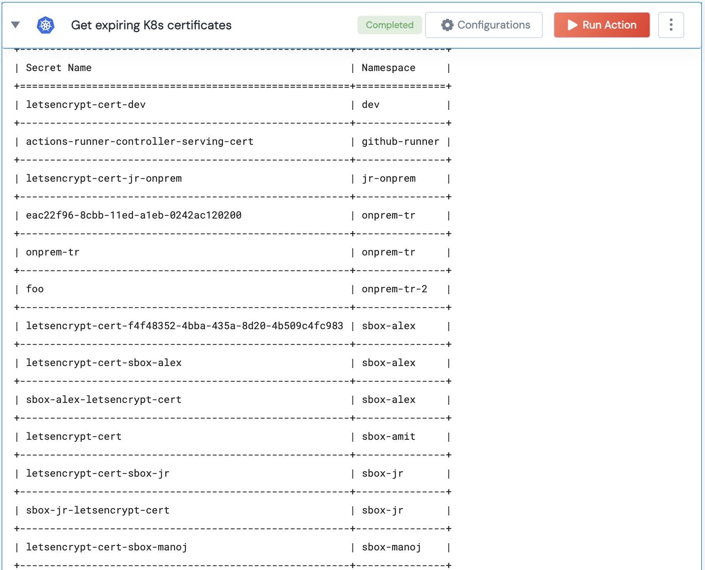

 
<h1>Get All Deployment Status From Namespace </h1>

## Description
This action gets the expiring certificates for a K8s cluster.

## Lego Details

    k8s_get_expiring_certificates(handle, expiring_threshold: int = 90, namespace: str = "")

        handle: Object of type unSkript K8S Connector
        namespace (str) : Optional - k8s namespace.
        expiration_threshold (int): The threshold (in seconds) for considering a certificate as expiring soon.

## Lego Input

This Lego take three inputs handle, deployment and expiration_threshold.

## Lego Output
Here is a sample output.

## See it in Action

You can see this Lego in action following this link [unSkript Live](https://us.app.unskript.io)