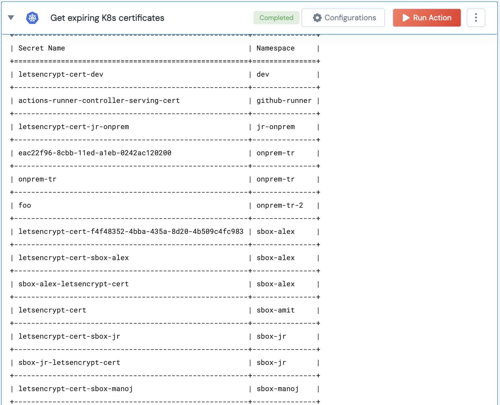

 
<h1>Check the valifity of K8s certificate for a cluster. </h1>

## Description
This action checks if the certificate is expiring for a K8s cluster.

## Lego Details

    k8s_get_expiring_cluster_certificate(handle, expiring_threshold: int = 7)

        handle: Object of type unSkript K8S Connector
        expiration_threshold (int): The threshold (in days) for considering a certificate as expiring soon.

## Lego Input

This Lego take three inputs handle, expiration_threshold.

## Lego Output
Here is a sample output.

## See it in Action

You can see this Lego in action following this link [unSkript Live](https://us.app.unskript.io)