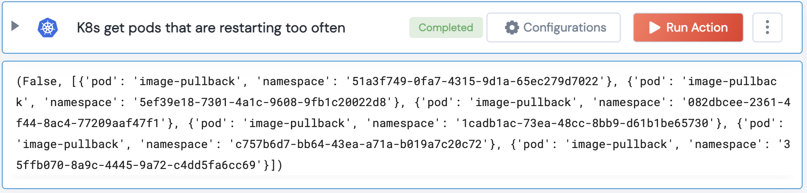

[]
(https://unskript.com/assets/favicon.png)
<h1>Get frequently restarting K8s pods</h1>

## Description
Get Kubernetes pods from all namespaces that are restarting too often.

## Lego Details
	k8s_get_frequently_restarting_pods(handle, restart_threshold:int=90)
		handle: Object of type unSkript K8S Connector.
		restart_threshold: Threshold number of times for which a pod should be restarting

## Lego Input
This Lego takes inputs handle, restart_threshold.

## Lego Output
Here is a sample output.

## See it in Action

You can see this Lego in action following this link [unSkript Live](https://us.app.unskript.io)