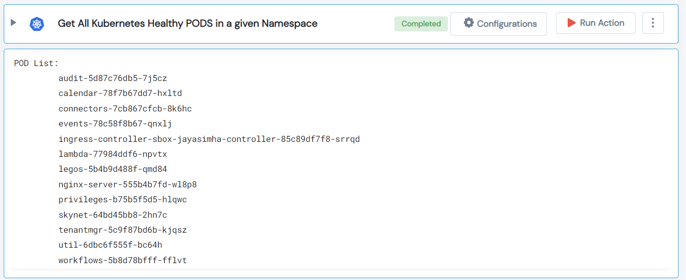

 
<h2>Get All Kubernetes Healthy PODS</h2>

 

## Description
This Lego get All Kubernetes Healthy PODS in a given Namespace.

## Lego Details

    k8s_get_healthy_pods(handle: object, namespace: str)

        handle: Object of type unSkript K8S Connector
        namespace: Kubernetes namespace.

## Lego Input
This Lego take two input handle and namespace.

## Lego Output
Here is a sample output.

## See it in Action

You can see this Lego in action following this link [unSkript Live](https://us.app.unskript.io)