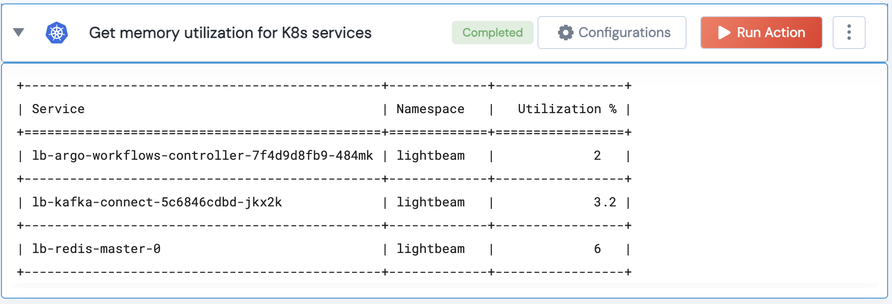
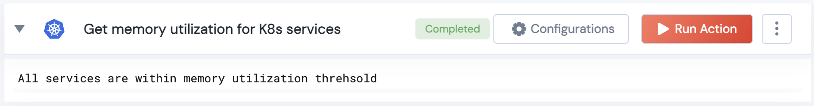

[]
(https://unskript.com/assets/favicon.png)
<h1>Get K8s services exceeding memory utilizations</h1>

## Description
This action executes the given kubectl commands to find the memory utilization of the specified services in a particular namespace and compares it with a given threshold.

## Lego Details
	k8s_get_memory_utilization_of_services(handle, services: list, namespace: str, threshold=80:float)
		handle: Object of type unSkript K8S Connector.
		services: List of pod names of the services for which memory utilization is to be fetched.
		namespace: Namespace in which the services are running.
		threshold: Threshold for memory utilization percentage. Default is 80%.

## Lego Input
This Lego takes inputs handle, services, namespace, threshold.

## Lego Output
Here is a sample output.

## See it in Action

You can see this Lego in action following this link [unSkript Live](https://us.app.unskript.io)