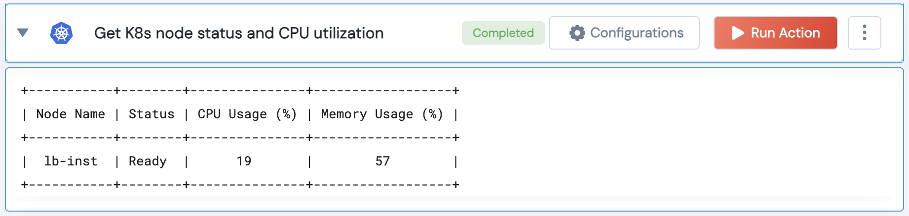

[]
(https://unskript.com/assets/favicon.png)
<h1>Get K8s Nod Status and Resource Utilization Info</h1>

## Description
This action gathers Kubernetes node status and CPU utilization information.

## Lego Details
	k8s_get_node_status_and_resource_utilization(handle)
		handle: Object of type unSkript K8S Connector.

## Lego Input
This Lego takes inputs handle.

## Lego Output
Here is a sample output.

## See it in Action

You can see this Lego in action following this link [unSkript Live](https://us.app.unskript.io)