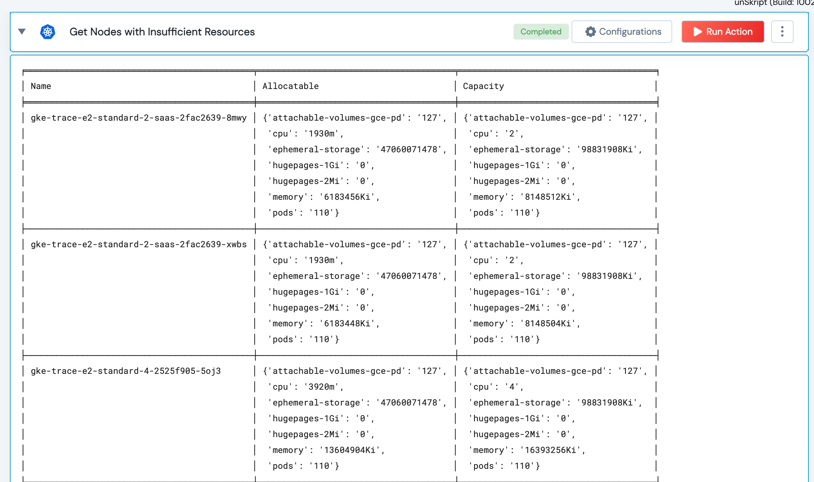

 
<h2>Get K8S Nodes with Insufficient resources </h2>

 

## Description
This Lego Returns Nodes that have insufficient resources 

## Lego Details

    k8s_get_nodes_with_insufficient_resources(handle: object, threshold: int)

        handle: Object of type unSkript K8S Connector
        threshold: Optional int Threshold for CPU and Memory utilization. 

## Lego Input
This Lego takes just two inputs, the Handle and Threshold (Optional)

## Lego Output
Here is a sample output.

## See it in Action

You can see this Lego in action following this link [unSkript Live](https://us.app.unskript.io)