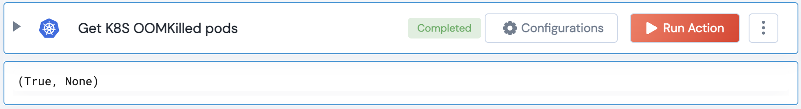

[]
(https://unskript.com/assets/favicon.png)
<h1>Get K8S OOMKilled Pods</h1>

## Description
Get K8S Pods which are OOMKilled from the container last states.

## Lego Details
	k8s_get_oomkilled_pods(handle, namespace: str = "")
		handle: Object of type unSkript K8S Connector.
		namespace: String, K8S Namespace as python string

## Lego Input
This Lego takes inputs handle, namespace.

## Lego Output
Here is a sample output.

## See it in Action

You can see this Lego in action following this link [unSkript Live](https://us.app.unskript.io)