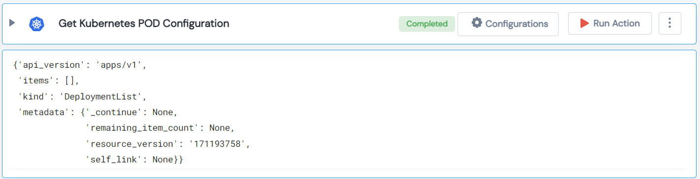

 
<h2>Get Kubernetes POD Configuration</h2>

 

## Description
This Lego get Kubernetes POD Configuration.

## Lego Details

    k8s_get_pod_config(handle: object, namespace: str, pod: str)

        handle: Object of type unSkript K8S Connector
        namespace: Kubernetes namespace.
        pod: Kubernetes Pod Name.

## Lego Input
This Lego take three input handle, namespace and pod.

## Lego Output
Here is a sample output.

## See it in Action

You can see this Lego in action following this link [unSkript Live](https://us.app.unskript.io)