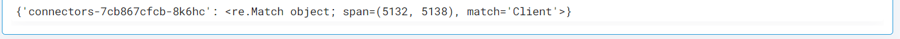

 
<h2>Get Kubernetes Logs for a list of PODs</h2>

 

## Description
This Lego get Kubernetes Logs for a list of PODs and Filter in a Namespace.

## Lego Details

    k8s_get_pod_logs_and_filter(handle: object, namespace: str, pods: List, matchstr: str)

        handle: Object of type unSkript K8S Connector
        namespace: k8s namespace.
        pods: Name of pods.
        matchstr: String to Match in the Logs.

## Lego Input
This Lego take four input handle, namespace, pods and matchstr.

## Lego Output
Here is a sample output.

## See it in Action

You can see this Lego in action following this link [unSkript Live](https://us.app.unskript.io)