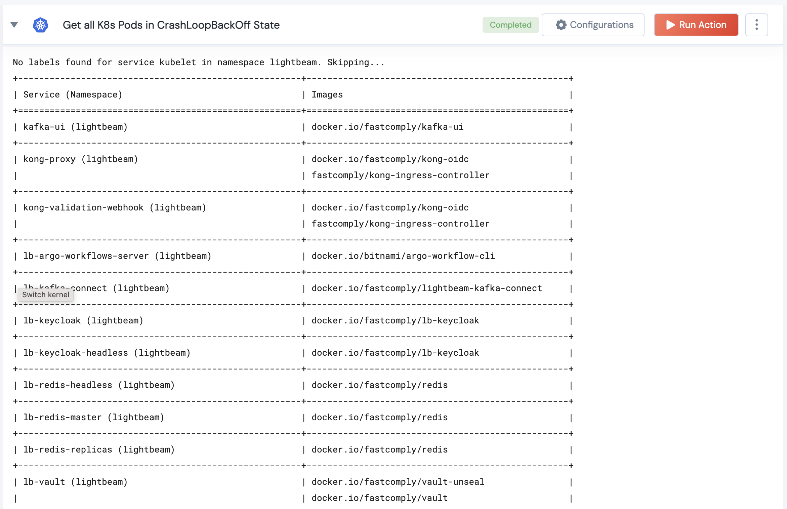

 
<h2>Get images of K8s services</h2>

 

## Description
Collect images of running services in the provided namespace.

## Lego Details

    k8s_get_service_images(handle, namespace:str = "")

        handle: Object of type unSkript K8S Connector
        namespace: Kubernetes namespace.

## Lego Input
This Lego take three input handle, namespace (Optional).

## Lego Output
Here is a sample output.

## See it in Action

You can see this Lego in action following this link [unSkript Live](https://us.app.unskript.io)