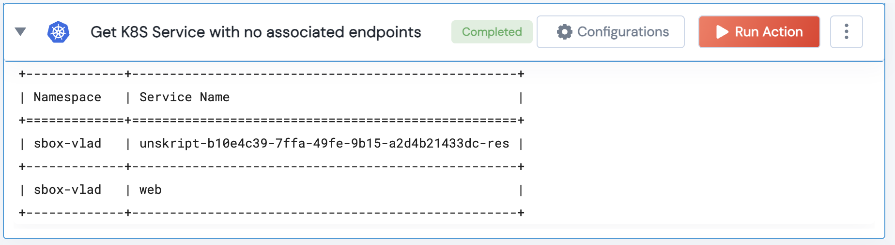

 
<h2>Get Service with no associated endpoints </h2>

 

## Description
This Lego Returns services that has no associated endpoints

## Lego Details

    k8s_get_service_with_no_associated_endpoints(handle: object)

        handle: Object of type unSkript K8S Connector

## Lego Input
This Lego takes just one input, the Handle

## Lego Output
Here is a sample output.

## See it in Action

You can see this Lego in action following this link [unSkript Live](https://us.app.unskript.io)