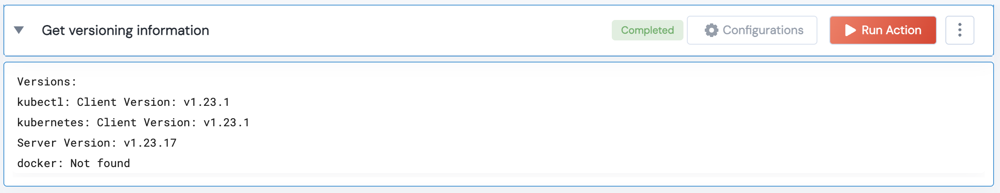

 
<h1>Get versioning info</h1>

## Description
This action gets the kubectl, Kubernetes cluster, and Docker version if available.

## Lego Details

    k8s_get_versioning_info(handle)

        handle: Object of type unSkript K8S Connector

## Lego Input

This Lego take two inputs handle.

## Lego Output
Here is a sample output.

## See it in Action

You can see this Lego in action following this link [unSkript Live](https://us.app.unskript.io)