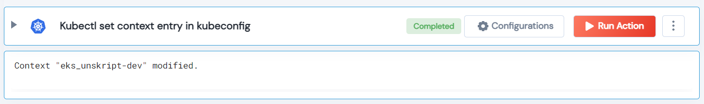

 
<h2>Kubectl set context entry in kubeconfig</h2>

 

## Description
This Lego used to set Kubectl context entry in kubeconfig.

## Lego Details

    k8s_kubectl_config_set_context(handle: object, k8s_cli_string: str, namespace: str)

        handle: Object of type unSkript MongoDB Connector
        k8s_cli_string: kubectl sets a context entry in kubeconfig
        namespace: Namespace

## Lego Input
This Lego take three inputs handle, k8s_cli_string and namespace.

## Lego Output
Here is a sample output.

## See it in Action

You can see this Lego in action following this link [unSkript Live](https://us.app.unskript.io)