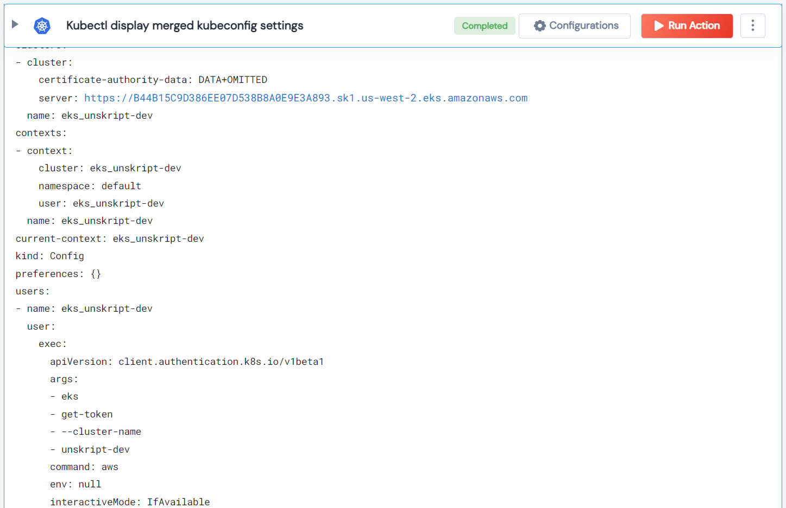

 
<h2>Kubectl display merged kubeconfig settings</h2>

 

## Description
This Lego Kubectl display merged kubeconfig settings.

## Lego Details

    k8s_kubectl_config_view(handle: object, k8s_cli_string: str, namespace: str)

        handle: Object of type unSkript K8S Connector
        k8s_cli_string: kubectl Displays merged kubeconfig settings.
        namespace: Namespace.

## Lego Input
This Lego take three input handle, k8s_cli_string and namespace.

## Lego Output
Here is a sample output.

## See it in Action

You can see this Lego in action following this link [unSkript Live](https://us.app.unskript.io)