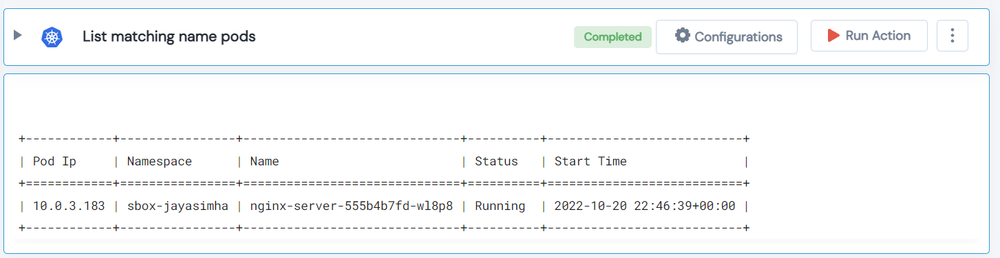

 
<h2>List matching name pods</h2>

 

## Description
This Lego List all pods matching a particular name string. The matching string can be a regular expression too.

## Lego Details

    k8s_list_all_matching_pods(handle: object, matchstr: str, namespace: str)

        handle: Object of type unSkript K8S Connector
        matchstr: Matching name string. The matching string can be a regular expression too.
        namespace: Namespace

## Lego Input
This Lego take three input handle, matchstr and namespace.

## Lego Output
Here is a sample output.

## See it in Action

You can see this Lego in action following this link [unSkript Live](https://us.app.unskript.io)