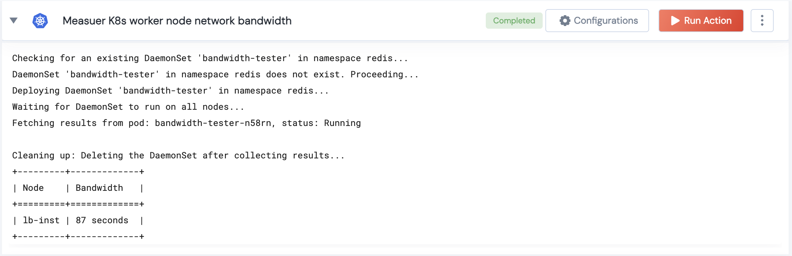

[]
(https://unskript.com/assets/favicon.png)
<h1>Measure K8s worker node network bandwidth</h1>

## Description
Measures the network bandwidth for each worker node using a DaemonSet and returns the results.

## Lego Details
	k8s_measure_worker_node_network_bandwidth(handle, namespace: str)
		handle: Object of type unSkript K8S Connector.
		namespace: The namespace where the DaemonSet will be deployed.

## Lego Input
This Lego takes inputs handle, namespace.

## Lego Output
Here is a sample output.

## See it in Action

You can see this Lego in action following this link [unSkript Live](https://us.app.unskript.io)