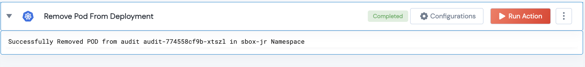

 
<h2>Remove POD From Deployment</h2>

 

## Description
This Action can be used to remove a POD from Kubernetes deployment. We do it by using the `patch` API to update the existing label with `-out-for-maintenance` appended to them. This would make sure that the POD is removed from the deployment.

## Lego Details

    k8s_remove_pod_from_deployment(handle: object, pod_name: str, namespace: str)

        handle: Object of type unSkript K8S Connector
        pod_name: String, Name of the POD (Mandatory parameter)
        namespace: String, Namespace where the POD exists

## Lego Input
This Lego takes three mandatory inputs. Handle (K8S) object returned from the task.validator(...),
POD Name and Namespace where the POD exists. 

## Lego Output
Here is a sample output.

## See it in Action

You can see this Lego in action following this link [unSkript Live](https://us.app.unskript.io)