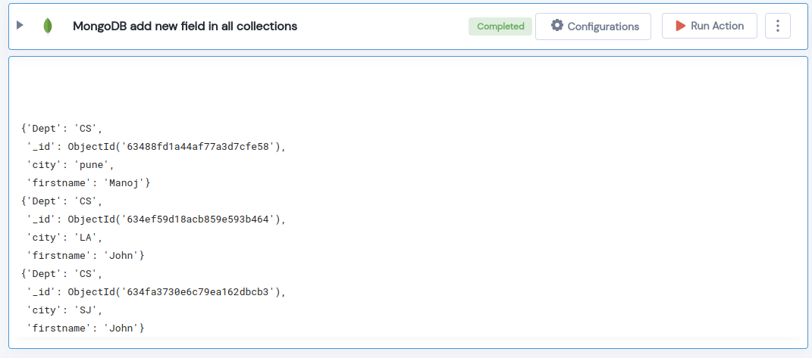

 
<h1>MongoDB add new field in all collections</h1>

## Description
This Lego Adds New feild in the MongoDB collection.

## Lego Details

    mongodb_add_new_field_in_collections(handle, database_name: str, collection_name: str, add_new_fields: dict, upsert: bool = True)

        handle: Object of type unSkript Mongodb Connector.
        database_name: Name of the MongoDB database.
        collection_name: Name of the MongoDB collection.
        add_new_fields: Add new fields to every document.
        upsert: Allow creation of a new document, if one does not exist.

## Lego Input
This Lego take five inputs handle, database_name, collection_name, add_new_fields and upsert.

## Lego Output
Here is a sample output.

## See it in Action

You can see this Lego in action following this link [unSkript Live](https://us.app.unskript.io)