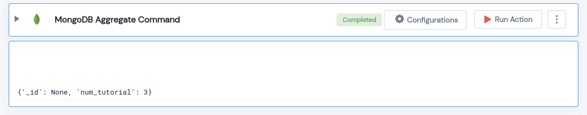

 
<h1>MongoDB Aggregate Command</h1>

## Description
This Lego Runs Agrregate commands on MongoDB.

## Lego Details

    mongodb_aggregate_command(handle, database_name: str, collection_name: str, pipeline: List)

        handle: Object of type unSkript Mongodb Connector.
        database_name: Name of the MongoDB database.
        collection_name: Name of the MongoDB collection.
        pipeline: A list of aggregation pipeline stages.

## Lego Input
This Lego take four input database_name, collection_name and pipeline. 

## Lego Output
Here is a sample output.

## See it in Action

You can see this Lego in action following this link [unSkript Live](https://us.app.unskript.io)