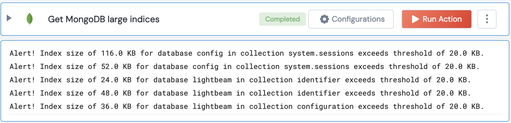

[]
(https://unskript.com/assets/favicon.png)
<h1>Get large MongoDB indices</h1>

## Description
This action compares the size of each index with a given threshold and returns any indexes that exceed the threshold.

## Lego Details
	mongodb_check_large_index_size(handle, threshold:float=1000)
		handle: Object of type unSkript MONGODB Connector.
		threshold: The threshold for index size in KB

## Lego Input
This Lego takes inputs handle, threshold.

## Lego Output
Here is a sample output.

## See it in Action

You can see this Lego in action following this link [unSkript Live](https://us.app.unskript.io)