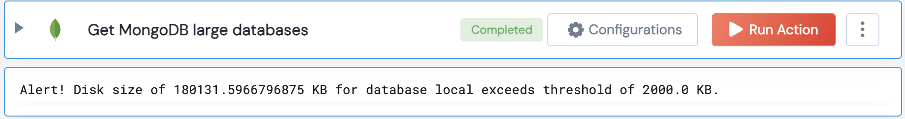

[]
(https://unskript.com/assets/favicon.png)
<h1>Get MongoDB large databases</h1>

## Description
This action compares the total disk size used by MongoDB to a given threshold.

## Lego Details
	mongodb_compare_disk_size_to_threshold(handle, threshold: float=2000)
		handle: Object of type unSkript MONGODB Connector.
		threshold: The threshold for disk size in KB.

## Lego Input
This Lego takes inputs handle, threshold.

## Lego Output
Here is a sample output.

## See it in Action

You can see this Lego in action following this link [unSkript Live](https://us.app.unskript.io)