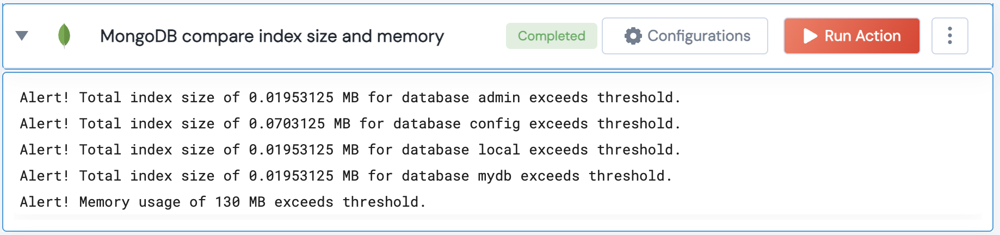

[]
(https://unskript.com/assets/favicon.png)
<h1>MongoDB compare index size and memory</h1>

## Description
This action retrieves database metrics such as index size, disk size per collection, and memory utilization for all databases. It calculates the total index size and compares it with the index threshold, and also compares total memory utilization with the memory threshold.

## Lego Details
	mongodb_compare_index_size_and_memory(handle, index_threshold:float=10, memory_threshold:float=300)
		handle: Object of type unSkript MONGODB Connector.
		index_threshold: The threshold for total index size.
		memory_threshold: The threshold for memory utilization.

## Lego Input
This Lego takes inputs handle, index_threshold, memory_threshold.

## Lego Output
Here is a sample output.

## See it in Action

You can see this Lego in action following this link [unSkript Live](https://us.app.unskript.io)