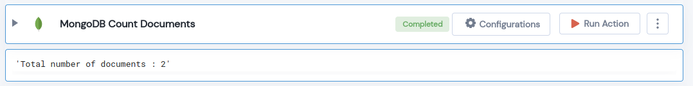

 
<h1>MongoDB Count Documents</h1>

## Description
This Lego Counts the doucuments in  MongoDB Collection.

## Lego Details

    mongodb_count_documents(handle, database_name: str, collection_name: str, filter: dict)

        handle: Object of type unSkript Mongodb Connector.
        database_name: Name of the MongoDB database.
        collection_name: Name of the MongoDB collection.
        filter: A query that matches the document to filter.

## Lego Input
This Lego take four inputs database_name, collection_name and filter. 

## Lego Output
Here is a sample output.

## See it in Action

You can see this Lego in action following this link [unSkript Live](https://us.app.unskript.io)