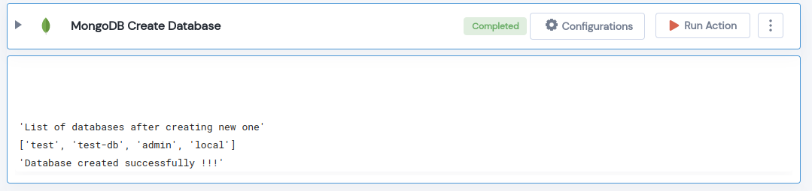

 
<h1>MongoDB Create Database</h1>

## Description
This Lego Creates a database in MongoDB.

## Lego Details

    mongodb_create_database(handle, database_name: str, collection_name: str)

        handle: Object of type unSkript Mongodb Connector.
        database_name: Name of the MongoDB database to be created.
        collection_name: Name of the MongoDB collection to be created.
## Lego Input
This Lego take three input handle, database_name and collection_name. 

## Lego Output
Here is a sample output.

## See it in Action

You can see this Lego in action following this link [unSkript Live](https://us.app.unskript.io)