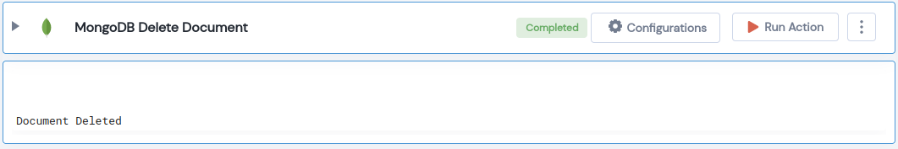

 
<h1>MongoDB Delete Document</h1>

## Description
This Lego Deletes the mongodb document.

## Lego Details

    mongodb_delete_document(handle, database_name: str, collection_name: str, command: DeleteCommands, filter: dict)

        handle: Object of type unSkript Mongodb Connector.
        database_name: Name of the MongoDB database.
        collection_name: Name of the MongoDB collection.
        DeleteCommands: Enum for DeleteCommand Options are delete_one or delete_many
        filter: Search Filter to perform the delete operation on.

## Lego Input
This Lego take five inputs handle, database_name, collection_name, DeleteCommands and filter.
 

## Lego Output
Here is a sample output.

## See it in Action

You can see this Lego in action following this link [unSkript Live](https://us.app.unskript.io)