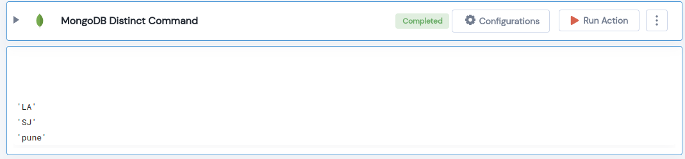

 
<h1>MongoDB Distinct Command</h1>

## Description
This Lego applys Distinct Command on query.

## Lego Details

    mongodb_distinct_command(handle, database_name: str, collection_name: str, key: str, filter=None)

        handle: Object of type unSkript Mongodb Connector.
        database_name: Name of the MongoDB database.
        collection_name: Name of the MongoDB collection.
        key: Name of the field for which we want to get the distinct values.
        filter: A query that matches the document to filter.

## Lego Input
This Lego take five inputs handle, database_name, collection_name, key, update  and filter.
 

## Lego Output
Here is a sample output.

## See it in Action

You can see this Lego in action following this link [unSkript Live](https://us.app.unskript.io)