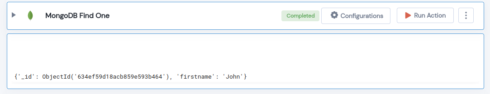

 
<h1>MongoDB Find One</h1>

## Description
This Lego MongoDB Finds One and returns a single entry that matches the query.

## Lego Details

    mongodb_find_one(handle, database_name: str, collection_name: str, filter: dict, projection: dict = {}, sort: List = [])

        handle: Object of type unSkript Mongodb Connector.
        database_name: Name of the MongoDB database.
        collection_name: Name of the MongoDB collection.
        filter: A query that matches the document to find.
        projection: A list of field names that should be returned/excluded in the result.
        sort: A list of {key:direction} pairs.

## Lego Input
This Lego take six inputs handle, database_name, collection_name, filter, projection  and sort.
 

## Lego Output
Here is a sample output.
 

## See it in Action

You can see this Lego in action following this link [unSkript Live](https://us.app.unskript.io)