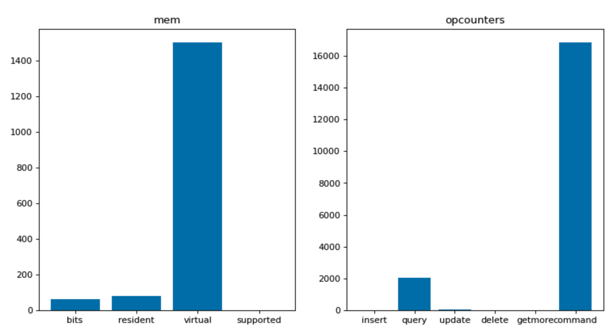

 
<h1>MongoDB Server Status </h1>

## Description
This Lego queries the server and retrieves vital statistics like
Memory, Uptime, Connections, etc..

## Lego Details

    mongodb_get_server_status(handle: object)

        handle: Object of type unSkript MongoDB Connector

## Lego Input
This Lego does not take any input. However it relies on the information provided in unSkript MongoDB Connector. 

## Lego Output
Here is a sample output.

## See it in Action

You can see this Lego in action following this link [unSkript Live](https://unskript.com)