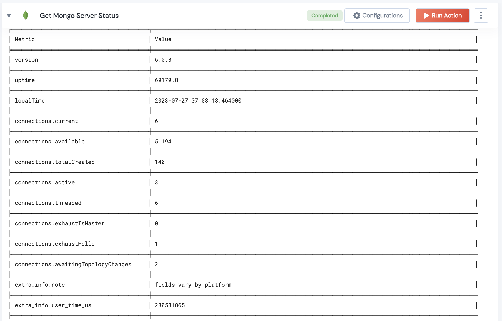

<h1>Get Mongo Server Status</h1>

## Description
This Lego Gets Mongo Server Status

## Lego Details

    mongodb_get_server_status(handle, connection_threshold: int = 1000, memory_threshold: int = 2048, cache_usage_threshold: int = 80)

        handle: Object of type unSkript Mongodb Connector.
        connection_threshold: Threshold for the number of connections considered abnormal
        memory_threshold: Threshold for the megabytes of resident memory usage considered abnormal (in megabytes)
        cache_usage_threshold: Threshold for the percentage of WiredTiger cache usage considered abnormal

## Lego Input
This Lego take only one input handle.

## Lego Output
Here is a sample output.

## See it in Action

You can see this Lego in action following this link [unSkript Live](https://us.app.unskript.io)