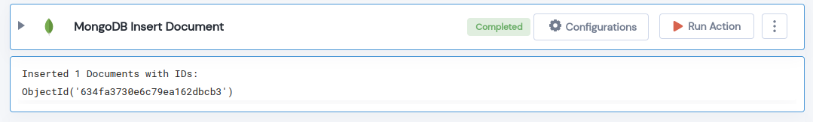

 
<h1>MongoDB Insert Document</h1>

## Description
This Lego Inserts Documents in MongoDb Collection.

## Lego Details

    mongodb_insert_document(handle, database_name: str, collection_name: str,  documents: list)

        handle: Object of type unSkript Mongodb Connector.
        database_name: Name of the MongoDB database.
        collection_name: Name of the MongoDB collection.
        documents: List of documents to be inserted.

## Lego Input
This Lego take four input handle, database_name and documents. 

## Lego Output
Here is a sample output.

## See it in Action

You can see this Lego in action following this link [unSkript Live](https://us.app.unskript.io)