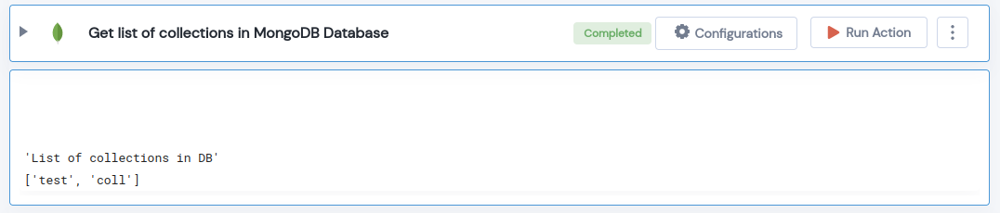

 
<h1>Get list of collections in MongoDB Database</h1>

## Description
This Lego Gets the list of collections in MongoDB Database.

## Lego Details

    mongodb_list_collections(handle, database_name: str)

        handle: Object of type unSkript Mongodb Connector.
        database_name: Name of the MongoDB database.

## Lego Input
This Lego take two inputs handle and database_name. 

## Lego Output
Here is a sample output.

## See it in Action

You can see this Lego in action following this link [unSkript Live](https://us.app.unskript.io)