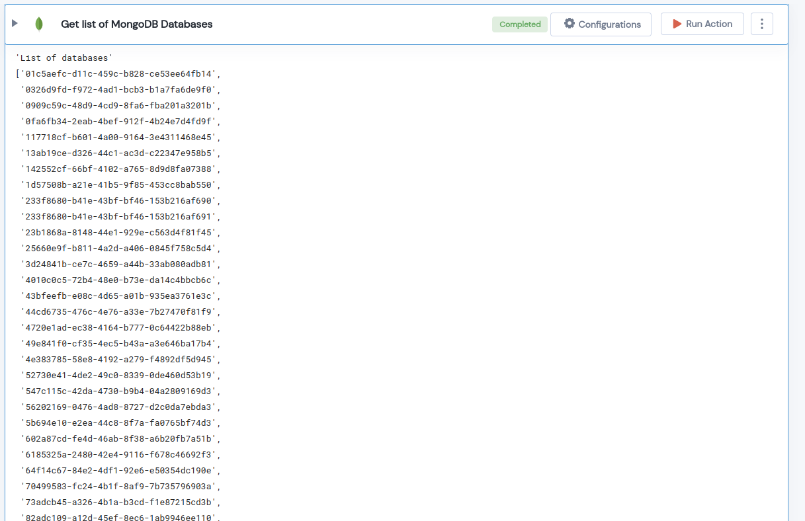

 
<h1>Get list of MongoDB Databases </h1>

## Description
This Lego Gets the list of MongoDB Databases.

## Lego Details

    mongodb_list_databases(handle) 

        handle: Object of type unSkript Mongodb Connector.
        

## Lego Input
This Lego take only one input handle. 

## Lego Output
Here is a sample output.

## See it in Action

You can see this Lego in action following this link [unSkript Live](https://us.app.unskript.io)