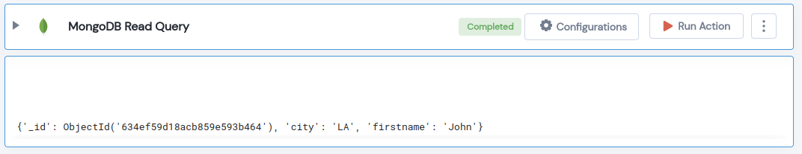

 
<h1>MongoDB Read Query</h1>

## Description
This Lego applys read query on mongodb collection

## Lego Details

    mongodb_read_query(handle, database_name: str, collection_name: str, query: dict)

        handle: Object of type unSkript Mongodb Connector.
        database_name: Name of the MongoDB database.
        collection_name: Name of the MongoDB collection.
        query: Read only query in dictionary format.

## Lego Input
This Lego take four inputs handle, database_name, collection_name and query.

## Lego Output
Here is a sample output.

## See it in Action

You can see this Lego in action following this link [unSkript Live](https://us.app.unskript.io)