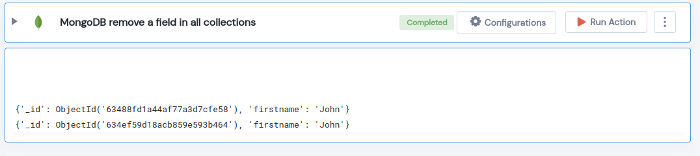

 
<h1>MongoDB remove a field in all collections</h1>

## Description
This Lego removes a field in all mongodb  collections.

## Lego Details

    mongodb_remove_field_in_collections(handle, database_name: str, collection_name: str, remove_fields: dict, upsert: bool = True)

        handle: Object of type unSkript Mongodb Connector.
        database_name: Name of the MongoDB database.
        collection_name: Name of the MongoDB collection.
        remove_fields: The  fields to be removed from every document.
        upsert: Allow creation of a new document, if one does not exist.

## Lego Input
This Lego take five inputs handle, database_name, collection_name, remove_fields and upsert.

## Lego Output
Here is a sample output.

## See it in Action

You can see this Lego in action following this link [unSkript Live](https://us.app.unskript.io)