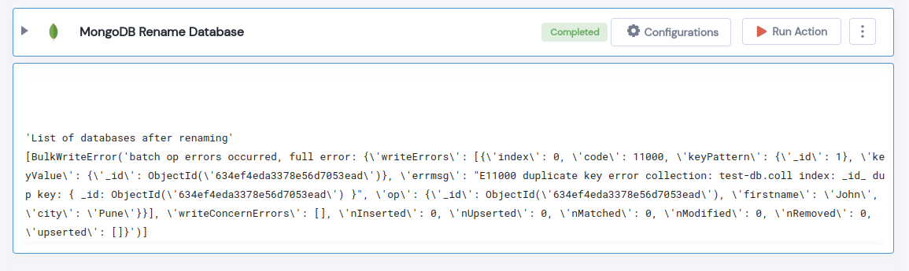

 
<h1>MongoDB Rename Database"</h1>

## Description
This Lego Renames MongoDB  Database"

## Lego Details

    mongodb_rename_database(handle, old_database_name: str, new_database_name: str)

        handle: Object of type unSkript AWS Connector
        old_database_name: Name of the MongoDB database wants to update.
        new_database_name: Name of the MongoDB database will be updated .

## Lego Input
This Lego take three input handle, old_database_name and new_database_name. 

## Lego Output
Here is a sample output.

## See it in Action

You can see this Lego in action following this link [unSkript Live](https://us.app.unskript.io)