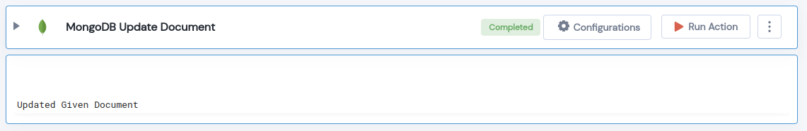

 
<h1>MongoDB Update Document</h1>

## Description
This Lego Updates MongoDB Document.

## Lego Details

    mongodb_update_document(handle,database_name: str,collection_name: str filter: dict,new_values: dict,command: UpdateCommands = UpdateCommands.update_one,upsert: bool = True) 

        handle: Object of type unSkript Mongodb Connector.
        database_name: Name of the MongoDB database.
        collection_name: Name of the MongoDB collection.
        filter: A query that matches the document to update.
        new_values: Update new fields to every document.
        command: Db command.
        upsert: Allow creation of a new document, if one does not exist.

## Lego Input
This Lego take seven inputs handle, database_name, collection_name, filter, new_values, command and upsert.

## Lego Output
Here is a sample output.

## See it in Action

You can see this Lego in action following this link [unSkript Live](https://us.app.unskript.io)